# RSSchool

## Perfomance

# Отчет о производительности

---

## Тестируемая операция

**Ввод текста в поле поиска: "A"**

- **Commit Duration**: 2.3 с
- **Render Duration**: 8.8 мс
- **Время рендеринга компонентов**:
  - `App`: <0.1 мс
  - `Search`: 0.2 мс
  - `CardList`: 8.6 мс
  - `Cards`: <0.1 – 0.2 мс

## Графики профилирования

- **Flame Graph**:
  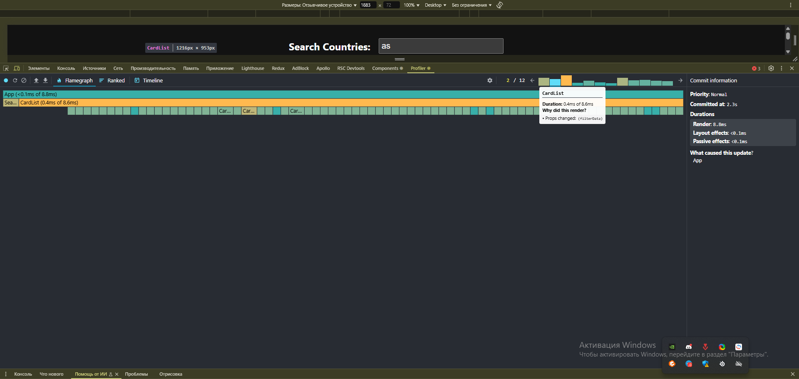

- **Ranked Chart**:
  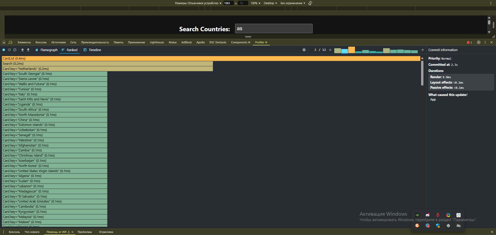

---

## Тестируемая операция

**Ввод текста в поле поиска: "AS"**

- **Commit Duration**: 5.7 с
- **Render Duration**: 0.6 мс
- **Время рендеринга компонентов**:
  - `App`: 0.1 мс
  - `Search`: <0.1 мс
  - `CardList`: 0.4 мс
  - `Cards`: <0.1 – 0.1 мс

## Графики профилирования

- **Flame Graph**:
  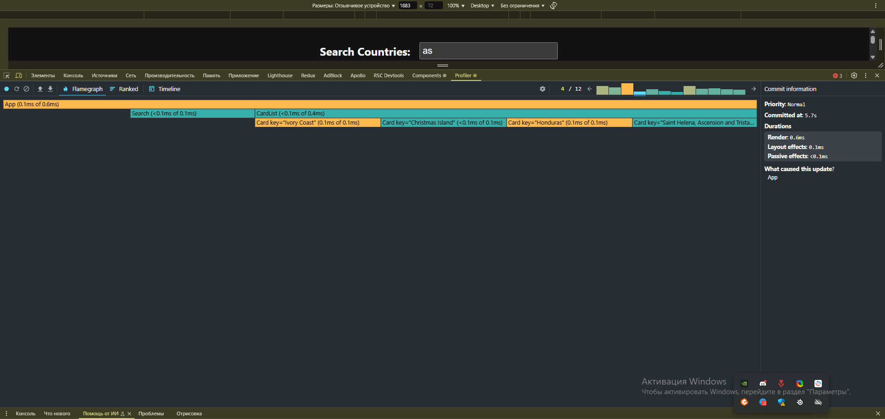

- **Ranked Chart**:
  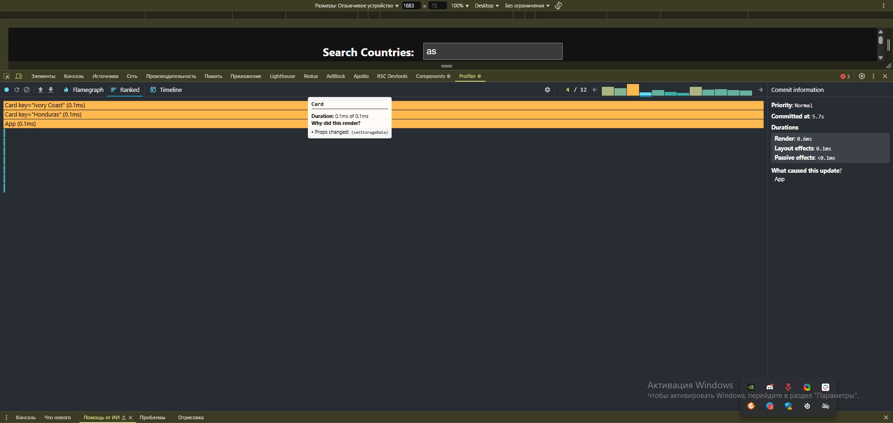

---

## Тестируемая операция

**Ввод текста в поле поиска: "ASD"**

- **Commit Duration**: 7.7 с
- **Render Duration**: 1 мс
- **Время рендеринга компонентов**:
  - `App`: 0.3 мс
  - `Search`: 0.4 мс
  - `CardList`: 0.3 мс
  - `Cards`: <0.1 – 0.1 мс

## Графики профилирования

- **Flame Graph**:
  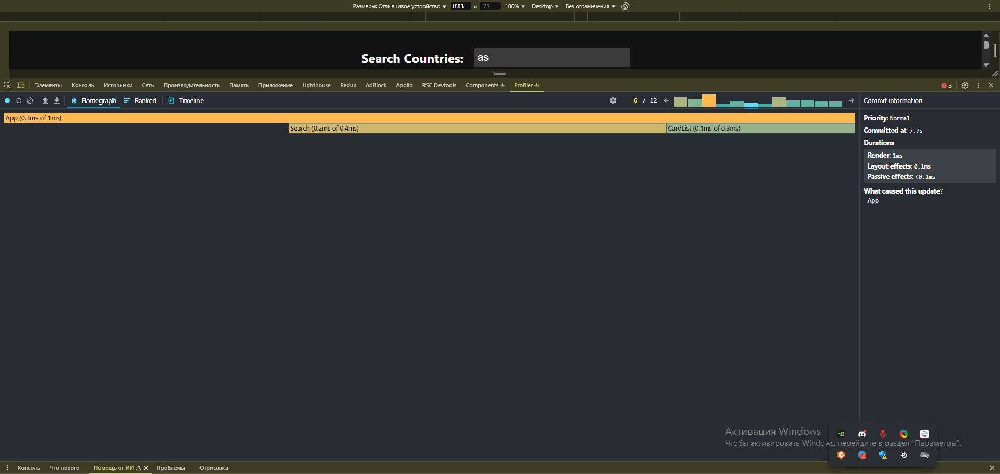

- **Ranked Chart**:
  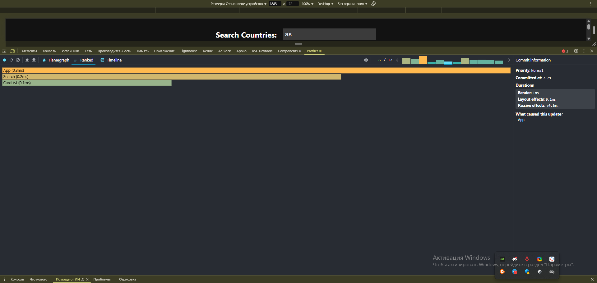

---

## Тестируемая операция

**Фильтрация по региону: All → Americans**

- **Commit Duration**: 11.2 с
- **Render Duration**: 15.1 мс
- **Время рендеринга компонентов**:
  - `App`: 0.1 мс
  - `Search`: 0.2 мс
  - `CardList`: 14.8 мс
  - `Cards`: <0.1 – 0.5 мс

## Графики профилирования

- **Flame Graph**:
  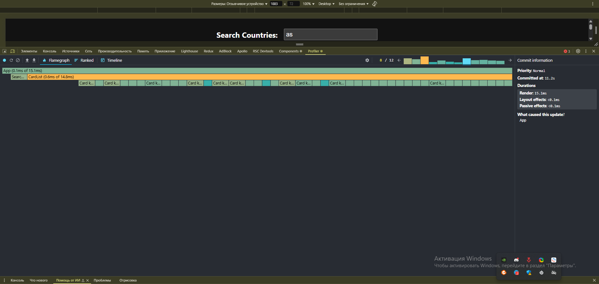

- **Ranked Chart**:
  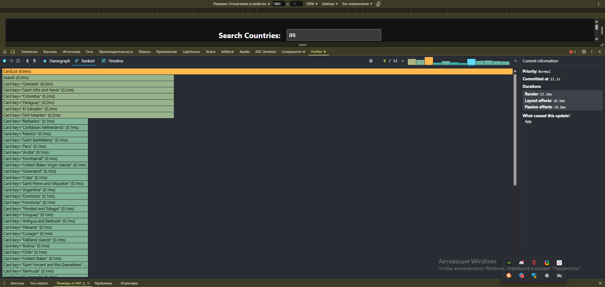

---

## Тестируемая операция

**Сортировка по имени (ASC)**

- **Commit Duration**: 14.1 с
- **Render Duration**: 5.4 мс
- **Время рендеринга компонентов**:
  - `App`: 0.1 мс
  - `Search`: 0.2 мс
  - `CardList`: 5.1 мс
  - `Cards`: <0.1 – 0.2 мс

## Графики профилирования

- **Flame Graph**:
  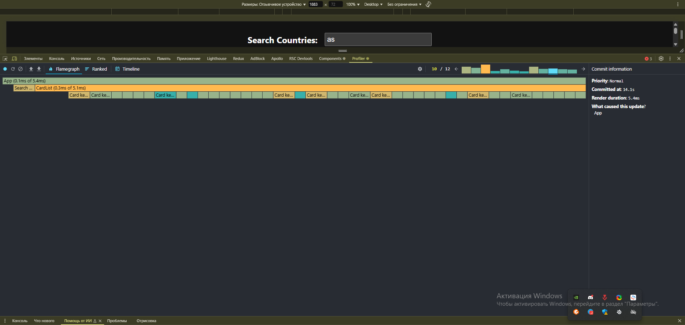

- **Ranked Chart**:
  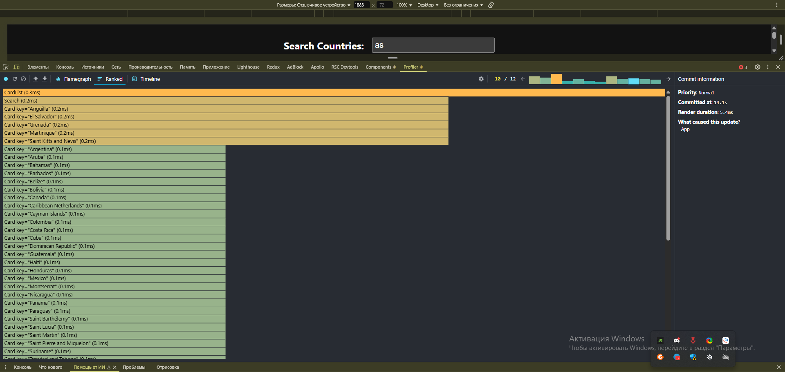

---

## Тестируемая операция

**Сортировка по населению (DESC)**

- **Commit Duration**: 17.7 с
- **Render Duration**: 3 мс
- **Время рендеринга компонентов**:

  - `App`: <0.1 мс
  - `Search`: 0.2 мс
  - `CardList`: 2.8 мс
  - `Cards`: 0.1 мс

  ## Графики профилирования

- **Flame Graph**:
  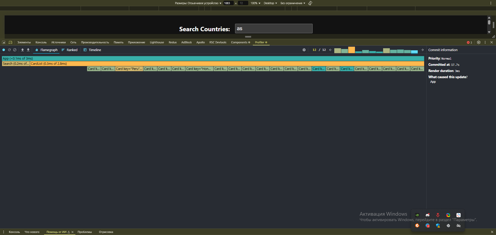

- **Ranked Chart**:
  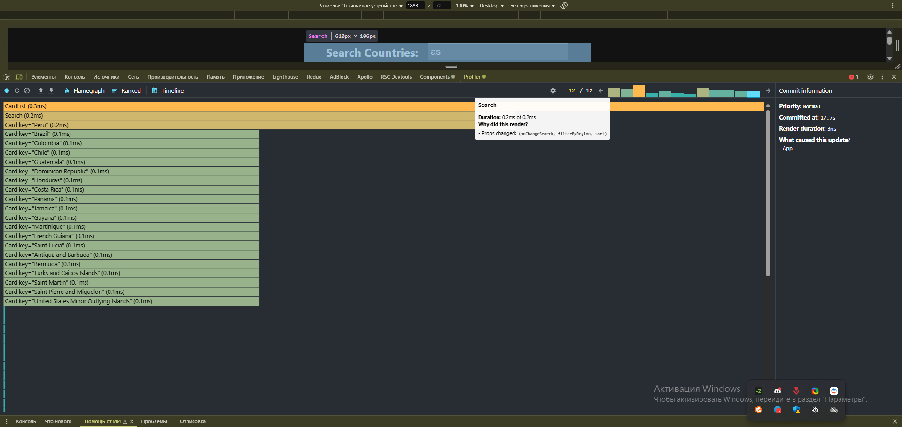
